# HW5 – Part III & Part IV

## Provisioning Resouces on AWS

### Terraform apply

I deployed the infrastructure using Terraform. The apply completed successfully, including pushing the container image and creating the ECS resources. The final Terraform outputs confirmed the ECS cluster and service names.

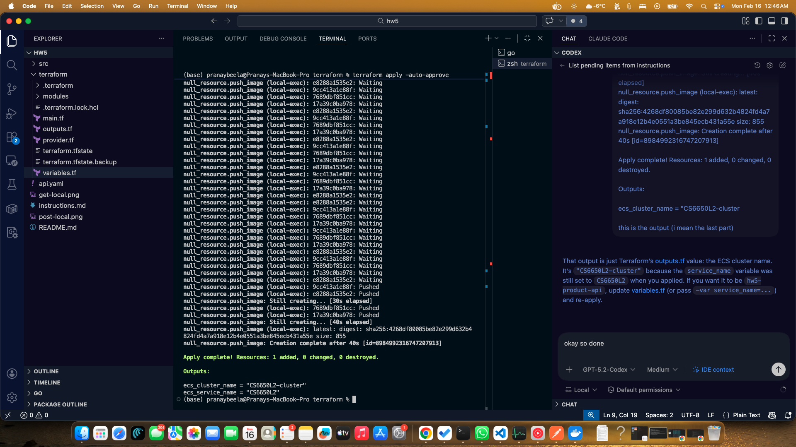

### ECS cluster verification

In the AWS ECS console, the cluster was visible and showed one service. The cluster also indicated that a task was running, confirming the deployment was active.

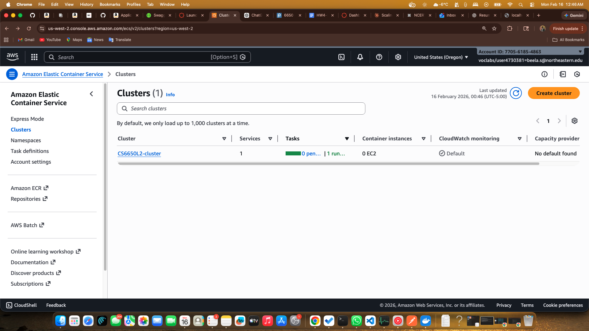

### ECS task verification

Inside the service, the task status showed **Running** and the container status was also **Running**. This verified the image was pulled correctly and the container started successfully.

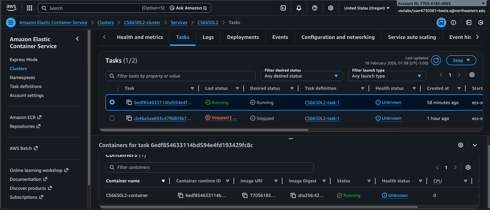

## Public endpoint testing (Postman)

### Incorrect POST path (expected failure)

I first sent a POST request to /products/12347 and received a **404 Not Found**. This was expected because the specification does not define a POST route at /products/{productId}.

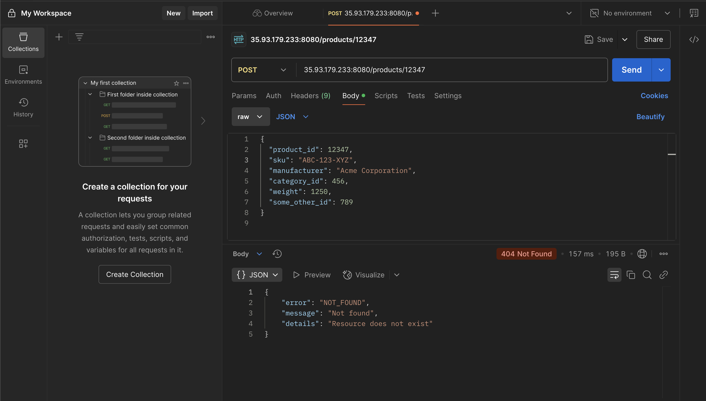

### Correct POST request (success)

I then sent a POST request to /products/12347/details with a valid JSON body. The API returned **204 No Content**, indicating the product details were accepted and stored.

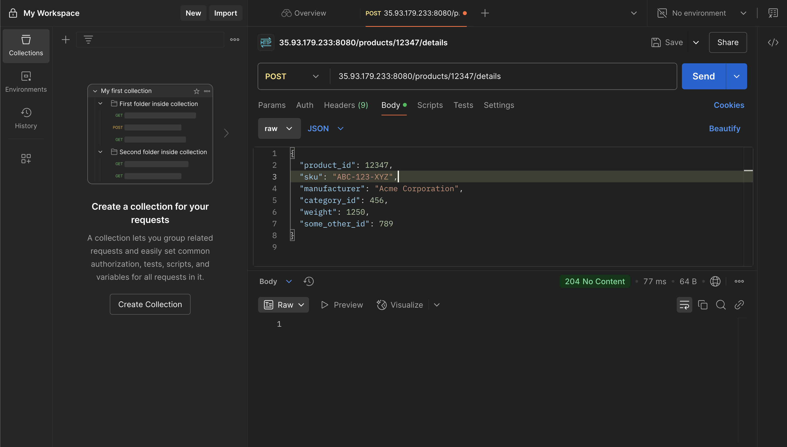

### Successful GET request

After posting details, I sent GET /products/12347 and received **200 OK** along with the stored product details. This confirmed the POST and GET flow worked end-to-end.

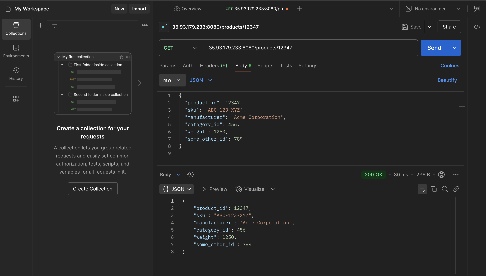

### GET not found case

I tested GET /products/123476 (an ID that was never created) and received **404 Not Found** with an appropriate error response. This confirmed missing products are handled correctly.

### Terraform destroy

After testing, I tore down the infrastructure with Terraform destroy. The destroy completed successfully, confirming cleanup of the deployed resources.

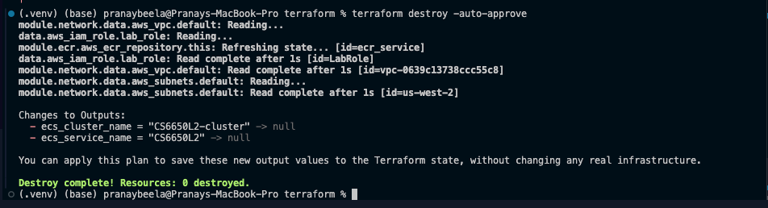

## Testing

I ran the load testing scenario against the Product API using both HttpUser and FastHttpUser. The test was executed on the same host with 30 users and a spawn rate of 2. The same set of Product API tasks was used in both runs, and the results were compared based on request rate, latency metrics, and failure counts.

### HttpUser Statistics and Graphs

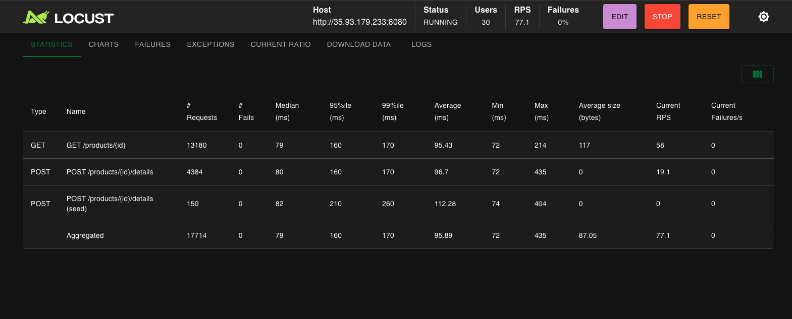

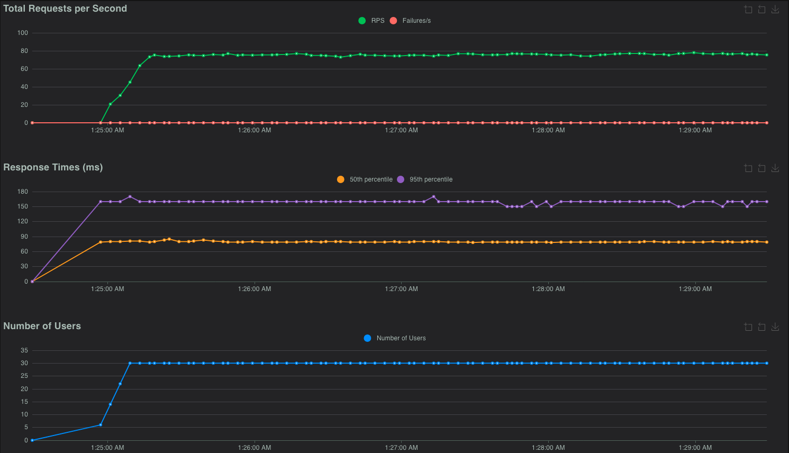

### FastHttpUser Statistics and Graphs

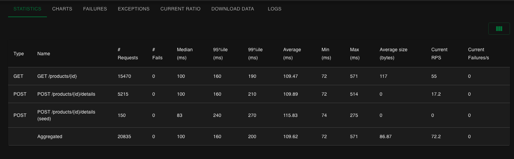

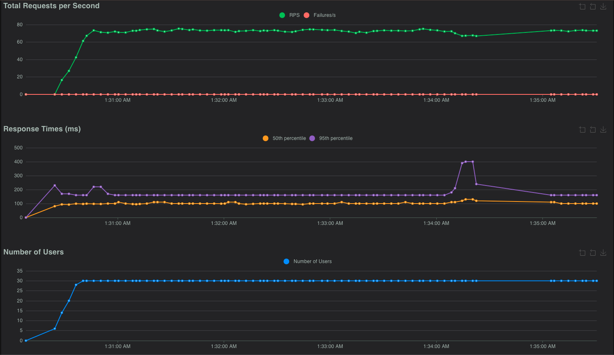

### Observations

#### Throughput (RPS)
Both tests stabilized around ~70–77 RPS after ramp-up. Switching to FastHttpUser did not noticeably increase sustained throughput, which suggests the backend service is the bottleneck, not the Locust client.

#### Latency
1. HttpUser stayed fairly consistent: median around ~80–100 ms, p95 ~160 ms, and p99 under ~200 ms.

2. FastHttpUser was similar on median/p95, but showed worse tail behavior, with p95 spikes up to ~400 ms and a slightly higher p99.

#### Failures
Both runs had 0% failures and stable RPS over time, meaning the service handled the load reliably. The main difference is that FastHttpUser produced more tail-latency spikes in this run.

#### Takeaway
At this load level, FastHttpUser did not provide a clear benefit. Scaling or optimizing the ECS service would likely improve results more than changing the Locust user type.

FastHttpUser is “better” mainly when the Locust client is the bottleneck (it can generate more requests with less client-side overhead). In my runs, both HttpUser and FastHttpUser reached a similar steady throughput (~70–77 RPS), which suggests the backend service (ECS/app/network) was the limiting factor, not Locust. Because the server was already near its capacity, switching to FastHttpUser did not increase RPS, and it even showed slightly worse tail latency at times due to increased burstiness/queueing on the server.

## QAs
### Which operations are most common in a real-world scenario?
In a typical online store, reads dominate writes. Users browse products and fetch product details far more often than they update product metadata. That means GET /products/{id} is usually much more frequent than POST /products/{id}/details.

### How does that impact the data structure used to store data?
Since reads are the common path, the in-memory store should be optimized for fast lookups by productId. A hash map/dictionary keyed by productId makes GET requests effectively constant-time. Writes (POST) are less frequent, so the main goal there is correctness and validation before updating the map.

### Scalable backend design for the online store 
I would split the system into separate domain services (or bounded contexts) such as Product, Cart, Warehouse/Inventory, and Payment. Each service would own its own data store (database and/or cache) so they can scale and deploy independently. An API Gateway or load balancer would route requests to the right service by path/host. For the Product API, since reads are likely heavy, I would place a cache (e.g., Redis) in front of it and use the product database as the source of truth. Warehouse and Payment would keep their own databases and only call Product when they need validation. This avoids a single monolith and makes scaling per-domain much easier.

### “Terraform is a declarative language” vs imperative, and why it helps
Declarative means you describe the end state you want (for example: an ECR repo, an ECS cluster, and a service running a specific task), and Terraform determines the steps needed to reach that state. You don’t manually script the sequence of actions like you would in an imperative approach (create repo → build → push → create cluster → create service). Terraform’s approach helps because it can plan changes, apply only what’s different, and tear everything down cleanly. It also makes infrastructure repeatable and consistent, since the same configuration can be applied across machines or environments.