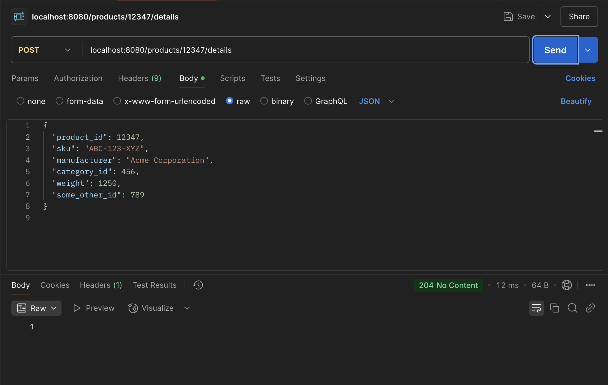
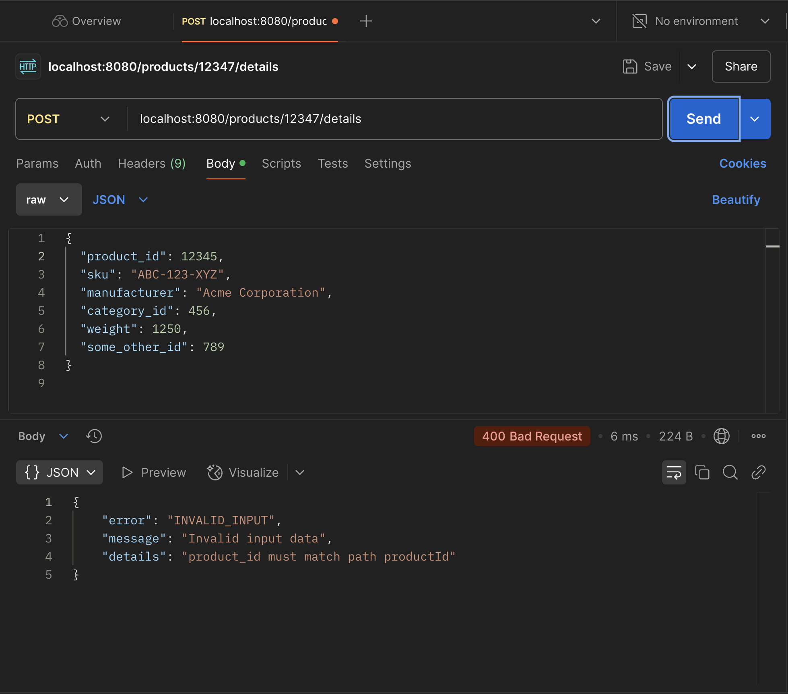
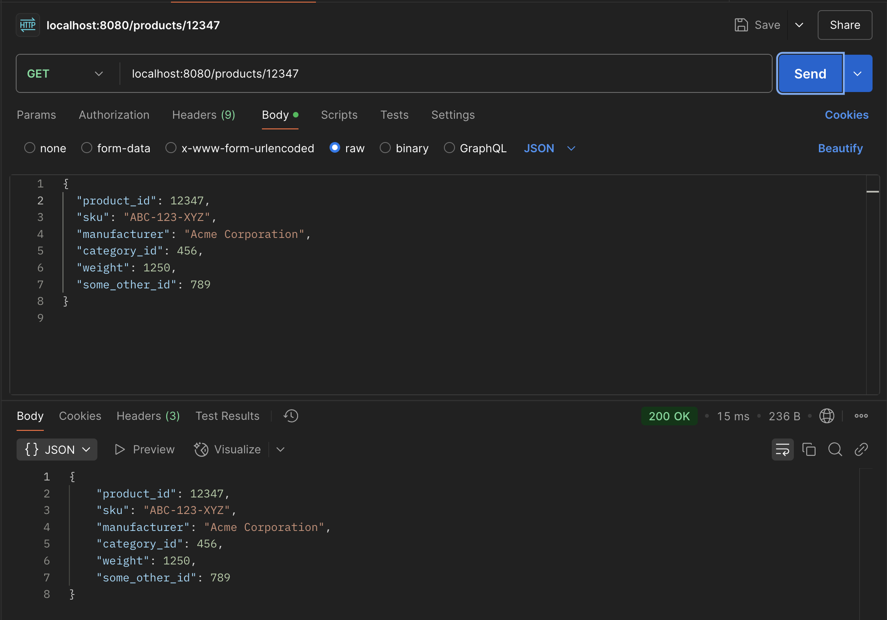
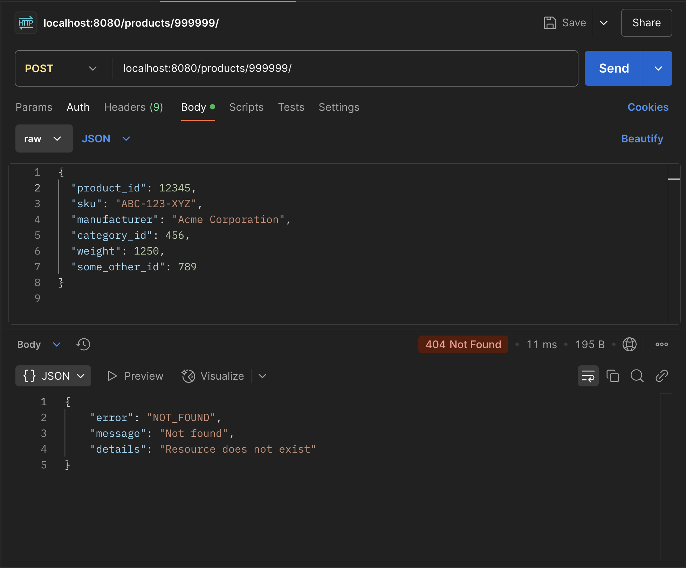

# HW5 Product API

Minimal Product API implementation based on `api.yaml` (Product endpoints only).

## Repository layout

- Server code: `src/main.go`
- Dockerfile: `src/Dockerfile`
- Terraform: `terraform/`
- Locust: `locust/locustfile.py`
- Report: `ANALYSIS.md`

## Run locally

```bash
cd src
go run .
```

Server listens on `:8080`.

## API usage

### Add or update product details

`POST /products/{productId}/details`

Example:

```bash
curl -i -X POST http://localhost:8080/products/12345/details \
  -H 'Content-Type: application/json' \
  -d '{
    "product_id": 12345,
    "sku": "ABC-123-XYZ",
    "manufacturer": "Acme Corporation",
    "category_id": 456,
    "weight": 1250,
    "some_other_id": 789
  }'
```

Expected responses:
- `204` on success
- `400` for invalid input

### Get product by ID

`GET /products/{productId}`

Example:

```bash
curl -i http://localhost:8080/products/12345
```

Expected responses:
- `200` with product JSON if found
- `404` if not found

## Response code examples

Use these to capture screenshots or a Postman collection.

- `204` (valid POST):
  - `POST /products/12345/details` with the example body above.

  

- `400` (invalid input):
  - `POST /products/12345/details` with missing required fields or `product_id` mismatch.

  

- `200` (found):
  - `GET /products/12345` after a successful POST.

  

- `404` (not found):
  - `GET /products/999999`.

  

## Docker

Build and run:

```bash
docker build -t hw5-product-api -f src/Dockerfile src
docker run --rm -p 8080:8080 hw5-product-api
```

## Deploy on a new machine (Terraform)

Prereqs:
- AWS credentials configured (env vars or `~/.aws/credentials`)
- Docker installed and running
- AWS CLI installed
- Terraform installed

Steps:

1. From repo root: `cd terraform`
2. Initialize: `terraform init`
3. Apply: `terraform apply -auto-approve`

This will:
- Build the Docker image from `src/`
- Push it to ECR
- Create ECS Fargate service and CloudWatch log group

To find the public IP:
- ECS console → Cluster → Service → Tasks → select task → Network → Public IP

Then call:

```bash
curl http://<PUBLIC_IP>:8080/products/12345
```
