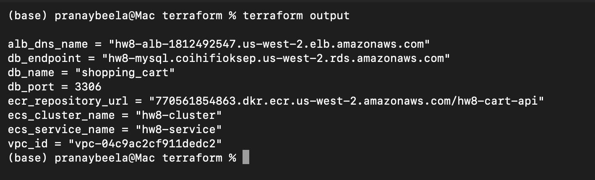
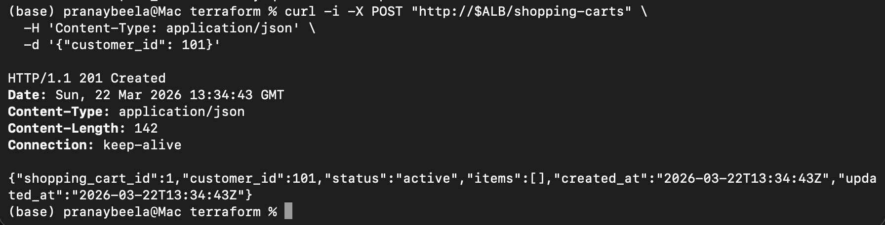
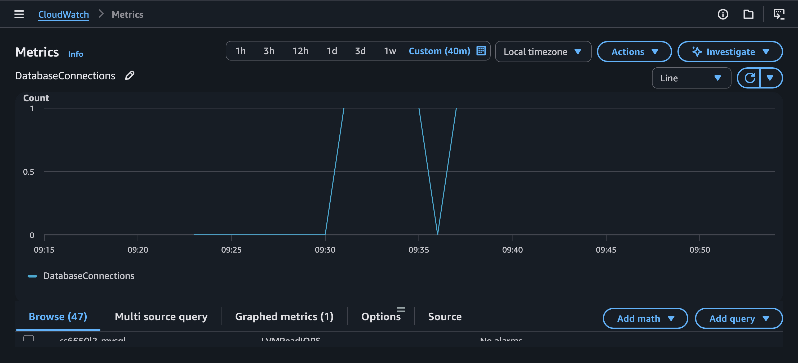
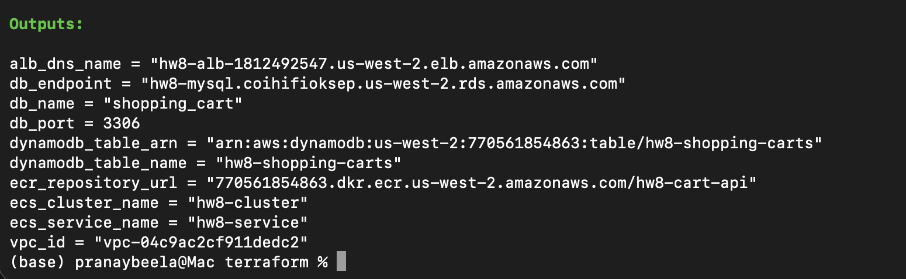
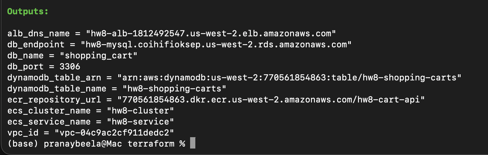
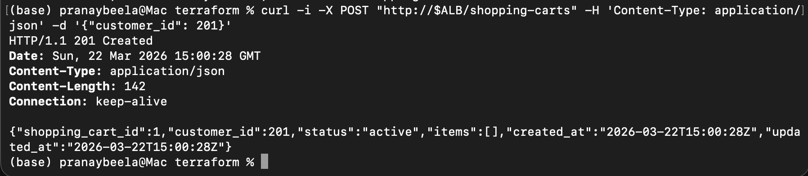
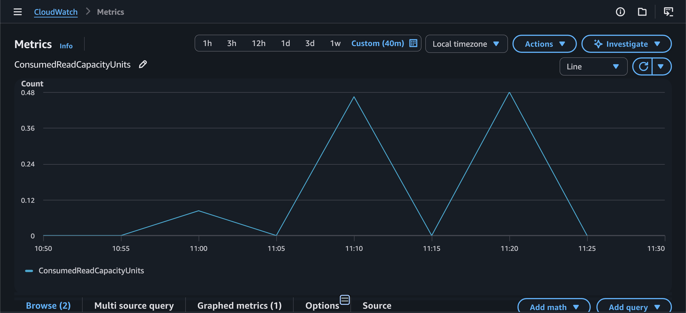

# HW8 Analysis

## Step I: MySQL Integration for Relational Data

### Part 1: Infrastructure Extension

For Homework 8, I built a self-contained AWS deployment in Terraform instead of extending an
older repo directly. The stack provisions the infrastructure needed to host a MySQL-backed
shopping cart API end to end:

- a dedicated VPC
- 2 public subnets for the ALB
- 2 private application subnets for ECS Fargate
- 2 private database subnets for RDS
- an Internet Gateway and NAT Gateway
- an ECR repository for the container image
- a CloudWatch log group
- an Application Load Balancer
- an ECS Fargate service
- an Amazon RDS MySQL 8.0 instance on `db.t3.micro`

The RDS instance is placed in private database subnets and protected by a security group that
allows MySQL traffic on port `3306` only from the ECS task security group. For assignment cleanup,
I configured:

- `skip_final_snapshot = true`
- `deletion_protection = false`

After deployment, Terraform reported these relevant outputs:

- `alb_dns_name = "hw8-alb-1812492547.us-west-2.elb.amazonaws.com"`
- `db_endpoint = "hw8-mysql.coihifioksep.us-west-2.rds.amazonaws.com"`
- `db_name = "shopping_cart"`
- `db_port = 3306`
- `ecs_cluster_name = "hw8-cluster"`
- `ecs_service_name = "hw8-service"`

Deployment evidence:



### Part 2: Database Schema Implementation

I designed a normalized relational schema with two tables: `carts` and `cart_items`.

#### Table Structure

`carts`

- `cart_id` as `BIGINT UNSIGNED AUTO_INCREMENT PRIMARY KEY`
- `customer_id`
- `status`
- `created_at`
- `updated_at`

`cart_items`

- `cart_item_id` as `BIGINT UNSIGNED AUTO_INCREMENT PRIMARY KEY`
- `cart_id`
- `product_id`
- `quantity`
- `created_at`
- `updated_at`

#### Why I Chose Two Tables

This structure matches the API access pattern in `api.yaml` very naturally:

- one cart can contain many items
- retrieving a cart should return both header fields and item rows
- item-level updates should be possible without rewriting the entire cart
- cart-item integrity should be enforced by the database

Keeping the header and items separate also avoids embedding cart contents into one large JSON
column, which would make partial updates and constraints weaker.

#### Key and Constraint Strategy

- `cart_id` is the primary key for `carts`
- `cart_item_id` is the primary key for `cart_items`
- `cart_items.cart_id` is a foreign key to `carts.cart_id`
- `ON DELETE CASCADE` ensures item rows are removed automatically if a cart is deleted
- `UNIQUE (cart_id, product_id)` prevents duplicate product rows in the same cart
- `CHECK (quantity > 0)` enforces valid quantities

#### Index Strategy

I added:

- `idx_carts_customer_id` on `carts.customer_id`
- `idx_carts_customer_updated` on `(customer_id, updated_at DESC)`
- `uq_cart_items_cart_product` on `(cart_id, product_id)`

These indexes support the required access patterns:

- fast cart lookup by ID
- customer history queries
- efficient upsert behavior for adding items
- quick retrieval of all items for a single cart

#### Concurrent Modification Strategy

For concurrent cart updates, I relied on InnoDB row-level locking and a transaction-based write
pattern:

1. update the cart timestamp
2. verify that the cart exists
3. insert or update the item row using `ON DUPLICATE KEY UPDATE`
4. commit

This allows different carts to be updated independently while also safely serializing concurrent
writes to the same `(cart_id, product_id)` pair.

#### Trade-Offs Considered

- A JSON-based single-table design would reduce joins, but it would weaken item-level integrity and
  make atomic item upserts harder.
- `AUTO_INCREMENT` cart IDs are simple and work well for the assignment.
- The schema is intentionally narrow and focused only on the shopping cart API, not the broader
  product catalog.

### Part 3: Shopping Cart API Implementation

I implemented the required MySQL-backed endpoints in Go using `net/http` and `database/sql` with
the MySQL driver:

- `POST /shopping-carts`
- `GET /shopping-carts/{id}`
- `POST /shopping-carts/{id}/items`
- `GET /health`

#### Implementation Details

The service reads its database settings from ECS environment variables:

- `DB_HOST`
- `DB_PORT`
- `DB_NAME`
- `DB_USER`
- `DB_PASSWORD`

Connection pooling is configured explicitly:

- `MaxOpenConns = 25`
- `MaxIdleConns = 10`
- `ConnMaxLifetime = 5m`
- `ConnMaxIdleTime = 2m`

On startup, the application:

1. waits for MySQL to become reachable
2. runs `CREATE TABLE IF NOT EXISTS` for both cart tables
3. starts serving traffic

#### Query Design

`POST /shopping-carts`

- inserts a row into `carts`
- returns the created cart with timestamps and empty `items`

`GET /shopping-carts/{id}`

- uses a `LEFT JOIN` from `carts` to `cart_items`
- returns the complete cart and all items in one response

`POST /shopping-carts/{id}/items`

- opens a transaction
- updates the cart timestamp
- fails with `404` if the cart does not exist
- upserts the item row with `ON DUPLICATE KEY UPDATE`
- commits the transaction

In the current implementation, posting the same product to the same cart again increments the
stored quantity.

#### API Validation Evidence

After deployment, the API returned the expected responses:

- `GET /health` returned `200 OK` with:
  - `{"status":"ok","db_host":"hw8-mysql.coihifioksep.us-west-2.rds.amazonaws.com"}`
- `POST /shopping-carts` returned `201 Created`
- `POST /shopping-carts/1/items` returned `204 No Content`
- `GET /shopping-carts/1` returned `200 OK` and included:
  - `customer_id = 101`
  - `status = "active"`
  - `items = [{"product_id":555,"quantity":2}]`

API evidence:





#### What Did Not Work Initially

I hit several real implementation issues during this step:

1. The Docker build failed because the image build copied `go.mod` but not `go.sum`, so the MySQL
   driver dependency could not be resolved inside Docker.
2. I initially created ECS-specific IAM roles, but the assignment environment expected everything
   to run under `LabRole`, so I changed the ECS task definition to use `LabRole`.
3. The first Terraform version created a dependency cycle between ECS and RDS when I tried to pass
   DB settings through the ECS module while also using the ECS security group for RDS access.
   I fixed this by moving the ECS task security group to the root Terraform module.
4. The ALB initially returned `503 Service Temporarily Unavailable` because the ECS target was not
   healthy yet. After the task stabilized and connected to the database successfully, the health
   endpoint returned `200 OK`.

#### What I Learned During Implementation

- The database integration itself was straightforward once the dependency and packaging issues were
  fixed.
- The hardest part was not the SQL logic; it was making the infrastructure, Docker image, ECS task,
  IAM role choice, and RDS networking align cleanly.
- The `LEFT JOIN` cart retrieval query and the upsert-based item write pattern were both simple and
  a good fit for the schema.

### Part 4: Required Performance Testing

I ran the required 150-operation MySQL test and saved the results to `mysql_test_results.json`.

#### Test Protocol

- 50 `POST /shopping-carts`
- 50 `POST /shopping-carts/{id}/items`
- 50 `GET /shopping-carts/{id}`
- total operations: `150`
- results file: `mysql_test_results.json`

The run started at `2026-03-22T13:39:14Z` and ended at `2026-03-22T13:39:47Z`, so the full test
completed in about `33 seconds`, well within the 5-minute limit.

#### MySQL Test Results Summary

Overall:

- total operations: `150`
- success rate: `100%`
- average response time: `221.40 ms`
- P50: `210.58 ms`
- P95: `302.78 ms`
- P99: `320.72 ms`

By operation:

| Operation | Count | Avg (ms) | P50 (ms) | P95 (ms) | P99 (ms) | Success |
|-----------|------:|---------:|---------:|---------:|---------:|--------:|
| CREATE_CART | 50 | 219.93 | 210.21 | 296.62 | 367.25 | 50/50 |
| ADD_ITEMS | 50 | 226.18 | 212.84 | 303.67 | 308.57 | 50/50 |
| GET_CART | 50 | 218.07 | 209.40 | 301.52 | 318.87 | 50/50 |

#### Performance Observations

- All 150 operations succeeded, which confirms the API and schema were stable under the required
  workload.
- Response times were fairly consistent across create, add, and get operations.
- `ADD_ITEMS` was the slowest operation on average, which makes sense because it performs a
  transaction and touches both the parent cart row and the unique `(cart_id, product_id)` item row.
- `GET_CART` was not dramatically faster than writes, suggesting that network and load balancer
  overhead contributed significantly to total latency in this setup.

#### Optimization Notes

At this stage, I did not need a major SQL rewrite to complete the 150-operation test successfully.
The important optimizations were structural:

- normalized schema with proper indexes
- explicit connection pool settings
- join-based retrieval for full-cart reads
- upsert logic backed by the unique cart-product constraint

The test results are strong enough to support the MySQL sections of the later comparison work in
Step III.

#### Brief Comparison with Week 5 In-Memory Approach

Compared with the Week 5 product service, the MySQL-backed Homework 8 service is clearly more
operationally complex. In Week 5, the API used an in-memory map and avoided database round trips
entirely. The Week 5 analysis reported:

- steady throughput around `70-77 RPS`
- `HttpUser` median latency around `80-100 ms`
- `HttpUser` `p95` around `160 ms`
- `HttpUser` `p99` under `200 ms`

By contrast, the Homework 8 MySQL test averaged `221.40 ms` across the 150 required operations,
with `p95 = 302.78 ms` and `p99 = 320.72 ms`.

This difference is consistent with the architecture change:

- Week 5 kept state in process memory
- Homework 8 sends every cart operation through the ALB, ECS task, and RDS database

The trade-off is that Homework 8 pays extra latency and infrastructure complexity, but gains
persistence, shared state across tasks, and relational integrity. The two workloads are not
perfectly identical, so the comparison should be treated as directional rather than strictly
apples-to-apples, but it still shows the expected cost of moving from in-memory state to durable
storage.

### Part 5: Learning Notes

#### What Surprised Me

The most surprising part of this step was that the application logic was simpler than the
infrastructure integration. The cart schema, join query, and upsert logic all fit the API
requirements cleanly, but getting Docker, ECS, RDS, IAM, and Terraform dependencies aligned took
more iteration than the SQL itself.

Another useful observation was how similar the response times were across create, add-item, and
get-cart requests. I expected reads to be noticeably faster than writes, but in this deployed setup
the differences were small:

- `CREATE_CART` avg: `219.93 ms`
- `ADD_ITEMS` avg: `226.18 ms`
- `GET_CART` avg: `218.07 ms`

That suggests the end-to-end request path through the ALB, ECS task, and RDS network round trip
contributed a large share of total latency.

#### What Failed Initially

Several parts of the first attempt did not work cleanly:

- The Docker build failed because I forgot to include `go.sum` in the image build context.
- I initially created dedicated ECS IAM roles, but the assignment environment expected the service
  to run under `LabRole`.
- The Terraform design created a dependency cycle when ECS needed RDS settings while RDS also
  needed the ECS security group reference.
- The ALB first returned `503` because the ECS target was not healthy yet.

These were all fixable, but they were good reminders that deployment details can block progress
even when the application code itself is correct.

#### How I Optimized for the Test Requirements

To make the 150-operation test reliable, I focused on a few practical optimizations:

- two-table normalized schema instead of a more complex denormalized design
- indexes for the actual access patterns used by the API
- explicit connection pool settings
- a single-query `LEFT JOIN` for full-cart retrieval
- transactional item writes using `ON DUPLICATE KEY UPDATE`

I did not need to rewrite the schema after testing, but I did improve the infrastructure and image
build setup so the application could start consistently and stay healthy behind the ALB.

#### What I Would Do Differently Next Time

If I were doing this again, I would:

- decide the IAM role strategy earlier so I would not have to rework ECS task roles later
- treat the container build as part of the first deployment design instead of as a later detail
- validate Terraform dependencies more carefully before the first full apply
- capture CloudWatch logs and target group health reasons immediately when the first `503` appeared

Overall, this step made the trade-off very clear: moving from in-memory state to MySQL gives
durability, shared state across tasks, and relational guarantees, but it also introduces more
operational complexity than the Week 5 in-memory version.

### Part 6: CloudWatch Monitoring

I reviewed CloudWatch metrics for the MySQL test window from `2026-03-22T13:35:00Z` to
`2026-03-22T13:45:00Z`, which covers the successful 150-operation test run.

#### RDS Metrics

`AWS/RDS` for `DBInstanceIdentifier = hw8-mysql`

RDS metric screenshots:




- `CPUUtilization`
  - average during the window: about `3.94%`
  - peak observed datapoint: about `4.46%`
- `DatabaseConnections`
  - mostly `1` active connection during the test window
  - peak observed datapoint: `1`
- `ReadIOPS`
  - average during the window: about `0.28`
  - peak observed datapoint: about `1.30`
- `WriteIOPS`
  - average during the window: about `1.44`
  - peak observed datapoint: about `9.58`

These metrics show that the `db.t3.micro` instance handled the required workload comfortably. CPU
stayed low, connection count stayed flat, and write activity was more noticeable than read activity,
which matches the test mix of cart creation and item insertion.

#### ECS Metrics

`AWS/ECS` for `ClusterName = hw8-cluster` and `ServiceName = hw8-service`

ECS metric screenshot:


- `CPUUtilization`
  - average across the window: about `0.15%`
  - peak observed datapoint: about `1.93%`
- `MemoryUtilization`
  - average across the window: about `4.21%`
  - peak observed datapoint: about `4.30%`

The ECS service stayed lightly loaded during the sequential test. CPU and memory both remained far
below the task limits, which suggests the service had substantial headroom for this assignment-scale
workload.

#### Monitoring Interpretation

- The RDS instance was not close to saturation during the 150-operation test.
- The database connection pool effectively reused a single connection for the sequential workload.
- ECS resource usage remained low, so application compute was not the limiting factor.
- The similar API response times across create, add, and get operations are consistent with a setup
  where network and service-hop overhead matter more than raw compute pressure.

## Step II: DynamoDB Integration

### Part 1: DynamoDB Table Design Challenge

For Step II Part 1, I extended the same `hw8` Terraform stack to provision DynamoDB alongside
MySQL so both backends can coexist for later comparison. The DynamoDB infrastructure uses a single
table intended for the shopping cart workload.

#### Table Design

I chose a single DynamoDB table with:

- partition key: `cart_id` (String)
- no sort key
- no secondary indexes
- billing mode: `PAY_PER_REQUEST`

The corresponding Terraform output is exposed as:

- `dynamodb_table_name = "hw8-shopping-carts"`

Step II infrastructure evidence:



#### Why Shopping Carts Fit NoSQL

Shopping carts are a good fit for DynamoDB because the access pattern is narrow and centered on a
single cart:

- create a cart
- retrieve a cart by ID
- update a cart's items

There is no strong need for multi-table joins, and the main lookup key is naturally the cart ID.

#### Partition Key Strategy

I chose `cart_id` as the partition key because:

- it aligns directly with the primary lookup path
- each cart gets its own key space
- normal shopping traffic should distribute cleanly across many different cart IDs

I did not add a sort key because the Step II access patterns do not require ordered sub-items or
range queries under one cart key.

#### Item Structure

Unlike the MySQL model, where items live in a separate `cart_items` table, the DynamoDB design is
document-oriented. Each cart will store its items as an embedded list inside the cart document, for
example:

```json
{
  "cart_id": "42",
  "customer_id": 1001,
  "status": "active",
  "items": [
    {"product_id": 2001, "quantity": 3},
    {"product_id": 2002, "quantity": 1}
  ],
  "created_at": "2026-03-22T13:00:00Z",
  "updated_at": "2026-03-22T13:05:00Z"
}
```

This is a better fit for DynamoDB because the most common read is "get the whole cart" rather than
"query child rows separately and join them later."

#### Index Strategy

I intentionally did not add GSIs in Part 1. The required Step II operations do not need them, and
avoiding unnecessary indexes keeps the design simpler and cheaper.

#### Capacity and Scalability Choice

I chose `PAY_PER_REQUEST` rather than provisioned capacity so the homework test can run without
manual read/write capacity planning. This reduces the risk of throttling caused by underestimating
load and makes the table easier to compare with MySQL at assignment scale.

#### Comparison with MySQL

Compared to the Step I MySQL design:

- MySQL uses two normalized tables with foreign keys.
- DynamoDB uses one table with embedded cart items.
- MySQL enforces structure in the database.
- DynamoDB shifts more structure and merge logic into the application.
- MySQL uses SQL joins and transactions.
- DynamoDB is optimized around single-item access patterns.

#### Trade-Offs Considered

- The DynamoDB design makes single-cart retrieval simple and avoids joins.
- Updating cart items will use a document-style read/modify/write pattern instead of a relational
  upsert.
- The design is very efficient for cart-by-ID access, but weaker for relational cross-cart queries
  such as customer history unless more indexes or a second access pattern are added later.

### Part 2: API Implementation

For Step II Part 2, I kept the same shopping cart HTTP API but added a DynamoDB-backed store behind
the handlers. The application now supports backend selection through environment configuration, so
the same container and the same ALB path structure can run either:

- `DB_TYPE = "mysql"`
- `DB_TYPE = "dynamodb"`

This keeps the comparison fair because the HTTP layer stays the same while only the data layer
changes.

#### Implementation Approach

The Go service now uses a shared `CartStore` interface with two implementations:

- `mysqlCartStore`
- `dynamoCartStore`

The DynamoDB implementation uses:

- `PutItem` to create a new cart document
- `GetItem` to retrieve a cart by partition key
- `UpdateItem` to update embedded cart items

To keep cart IDs compatible with the existing API shape, I used a counter item in the same table.
The special item with partition key `__counter__` is updated with DynamoDB's `ADD` operation to
produce the next sequential cart ID.

#### Data Modeling in the Application

The DynamoDB cart document stores:

- `cart_id`
- `customer_id`
- `status`
- `items`
- `created_at`
- `updated_at`

Item updates follow a document-style read/modify/write flow:

1. fetch the cart by `cart_id`
2. merge the incoming item into the `items` list
3. write the updated list back with `UpdateItem`

This is different from the MySQL `ON DUPLICATE KEY UPDATE` approach, but it matches the
single-document DynamoDB model chosen in Part 1.

#### Deployment and Validation Evidence

After switching the deployed service to `store_backend = "dynamodb"`, Terraform reported the
expected table outputs:

- `dynamodb_table_name = "hw8-shopping-carts"`
- `dynamodb_table_arn = "arn:aws:dynamodb:us-west-2:770561854863:table/hw8-shopping-carts"`

Deployment evidence:



The health endpoint confirmed that the running service was using DynamoDB:

- `GET /health` returned `200 OK`
- response body:
  - `{"status":"ok","backend":"dynamodb","table":"hw8-shopping-carts"}`


The shopping cart API also worked end to end on the DynamoDB backend:

- `POST /shopping-carts` returned `201 Created`
- `POST /shopping-carts/1/items` returned `204 No Content`
- `GET /shopping-carts/1` returned `200 OK`

Returned cart evidence:

- `shopping_cart_id = 1`
- `customer_id = 201`
- `status = "active"`
- `items = [{"product_id":777,"quantity":3}]`




#### Implementation Notes

- The same ALB and ECS service front door stayed in place; only the store backend changed.
- DynamoDB required no SQL migrations and no connection pool management.
- The application-level logic is slightly more responsible for merging and writing item state than
  in the MySQL version.

### Part 3: Eventual Consistency Investigation

For Step II Part 3, I ran a focused consistency investigation against the live DynamoDB-backed
deployment and saved the raw results to `dynamodb_consistency_results.json`. The goal was to
separate two different behaviors:

- normal read-after-write visibility for simple cart operations
- behavior under rapid concurrent updates to the same cart

#### Test Scenarios Used

I used three scenarios that match the assignment prompt:

1. create a cart and immediately retrieve it
2. add an item and immediately fetch the cart again
3. send rapid updates from multiple clients to the same cart

The test harness for this investigation is in `scripts/dynamodb_consistency_test.py`.

#### Observed Read-After-Write Behavior

For the single-writer scenarios, I did not observe visible eventual consistency delays during this
test run:

- create-then-get: 20/20 carts were readable on the first fetch attempt
- add-then-get: 20/20 item updates were visible on the first fetch attempt
- misses observed in either scenario: `0`

Measured first-read timings were:

- create-then-get average: `218.49 ms`
- create-then-get max: `305.72 ms`
- add-then-get average: `234.58 ms`
- add-then-get max: `298.02 ms`

These timings mainly reflect end-to-end API latency, because every successful verification happened
on the first read attempt. In other words, during this investigation I did not catch a case where
the cart write succeeded but the immediate follow-up read returned stale data.

#### Rapid Same-Cart Update Findings

The rapid-update scenario exposed a more important issue than eventual read delay. I ran 5 rounds
where 8 concurrent clients each attempted to add a different item to the same cart.

Results:

- all 40 write requests returned `204 No Content`
- incomplete rounds: `5/5`
- each final cart was still missing multiple items after about 2 seconds of polling

This means the main consistency risk in the current DynamoDB implementation is not simple
read-after-write delay. Instead, it is the application's read/modify/write update pattern:

1. fetch whole cart
2. merge items in memory
3. write back the full item list

When several clients do that at once, later writes can overwrite earlier ones. This is effectively
a lost-update problem.

#### What Was Most Affected

The patterns most affected were:

- multiple clients modifying the same cart at nearly the same time
- workloads where each request rewrites the full embedded item list

The patterns that behaved well were:

- one client creating a cart and immediately reading it back
- one client adding an item and immediately fetching the cart

#### How to Handle Consistency Gracefully

Based on this investigation, the best application responses would be:

- use `ConsistentRead` when a follow-up read must reflect the latest write immediately
- add optimistic locking with a version attribute and conditional writes
- avoid rewriting the entire `items` list on every update when many concurrent writers are expected
- return authoritative updated cart state from writes, or retry on detected update conflicts

#### Reflection

The most interesting takeaway was that DynamoDB's eventual consistency model was less visible in my
single-writer tests than I expected, but the document-style update strategy introduced a stronger
concurrency risk. That is an important contrast with the MySQL version, where row-level updates and
transaction semantics made same-cart concurrent modification safer by default.

### Part 4: Required Identical Testing

For Step II Part 4, I ran the exact same 150-operation test used for the MySQL implementation so
the later comparison will be valid:

- 50 `POST /shopping-carts`
- 50 `POST /shopping-carts/{id}/items`
- 50 `GET /shopping-carts/{id}`

I reused the same load-test methodology and JSON result shape, and saved the DynamoDB run to
`dynamodb_test_results.json`.

#### Validation Summary

- total operations: `150`
- successful operations: `150`
- status code distribution:
  - `201`: 50
  - `204`: 50
  - `200`: 50

This confirms the DynamoDB-backed API completed the required identical test without functional
errors.

#### Latency Summary

Overall latency:

- average: `232.32 ms`
- p50: `213.93 ms`
- p95: `310.23 ms`
- p99: `358.47 ms`

Per-operation averages:

- `create_cart`: `248.65 ms`
- `add_items`: `237.08 ms`
- `get_cart`: `211.24 ms`

Per-operation p95 values:

- `create_cart`: `328.59 ms`
- `add_items`: `311.43 ms`
- `get_cart`: `221.23 ms`

#### Comparison Readiness

The DynamoDB results file now matches the assignment's comparison prerequisites:

- exactly 150 operations
- 50 create operations
- 50 add-item operations
- 50 get-cart operations
- same JSON structure as `mysql_test_results.json`

That means both required backend result files now exist and are ready for Step III:

- `mysql_test_results.json`
- `dynamodb_test_results.json`

### Part 5: Learning Notes

#### What Surprised Me

The biggest surprise was that eventual consistency was not the most visible issue in the simple
single-writer tests. In the create-then-get and add-then-get scenarios, every immediate follow-up
read succeeded on the first attempt during my investigation run. What showed up more clearly was a
concurrency problem in the application logic: when several clients updated the same cart at once,
the read/modify/write pattern caused lost updates even though all requests returned success.

Another difference from MySQL was how much more of the data-shaping logic moved into the
application. In the MySQL version, the schema, unique key, and `ON DUPLICATE KEY UPDATE` pattern
handled more of the write semantics directly in the database. In DynamoDB, I had to think more
explicitly about item structure, counter generation, and concurrent-write behavior.

#### Design Evolution

My initial and final partition key choice was `cart_id`, and after testing I kept that design. It
matched the three required access patterns well:

- create a cart
- retrieve a cart by cart ID
- update a cart by cart ID

I did not see evidence of hot partition problems during the assignment-scale tests. The workload
spread across many cart IDs, and the 150-operation test plus consistency probe both completed
without throttling symptoms.

The part I would change in a later iteration is not the partition key, but the update strategy. I
validated the current design by:

- confirming all API endpoints worked end to end on the DynamoDB backend
- completing the 150-operation required test successfully
- running the eventual consistency probe against the live deployment

That validation showed the table design itself was acceptable for the homework access pattern, but
the current same-cart update method should be strengthened with conditional writes, optimistic
locking, or a more granular item model if concurrent writers are expected.

### Part 6: CloudWatch Monitoring

For Step II Part 6, I reviewed DynamoDB CloudWatch metrics during the live DynamoDB test window.
The main metrics captured were:

- `ConsumedReadCapacityUnits`
- `ConsumedWriteCapacityUnits`
- `SuccessfulRequestLatency`

#### Consumed Read Capacity

The read-capacity graph stayed low overall, with short spikes up to about `0.48` consumed units.
That fits the workload because the test used a moderate number of point reads by cart ID rather
than wide scans or repeated multi-item queries.



#### Consumed Write Capacity

The write-capacity graph was also modest, peaking around `0.97` consumed units. That was expected
because the workload included cart creation plus item updates, and the table was configured with
`PAY_PER_REQUEST`, so there was no manual capacity tuning needed during the test.


#### Successful Request Latency

The latency graph showed that DynamoDB service-side operation latency stayed in a low millisecond
range. `GetItem` appeared highest early in the captured window, `UpdateItem` was below that, and
`PutItem` remained the lowest of the three. Even though end-to-end API latency was higher once ALB,
ECS, and application processing were included, the underlying DynamoDB operation latency itself
looked stable.


#### Monitoring Takeaways

- I did not observe evidence of DynamoDB throttling during the assignment-scale tests.
- CloudWatch did not show a `ThrottledRequests` metric in the metric set I captured, but the API
  tests completed without throttling-like failures.
- The graphs support the earlier conclusion that the main DynamoDB challenge in this homework was
  application-side update behavior under concurrency, not raw table throughput.

## Step III: Database Comparison & Analysis

### Part 0: Pre-Analysis Data Verification

Before comparison, I verified that both backend result files met the assignment requirement:

- `mysql_test_results.json`: `150` operations
- `dynamodb_test_results.json`: `150` operations
- `combined_results.json`: `300` merged records total

Each backend contributed:

- `50` `create_cart`
- `50` `add_items`
- `50` `get_cart`

I created `combined_results.json` by merging both datasets and tagging each record with its source
database. This file is the single source used for all Step III comparisons.

Verification screenshot:


### Part 1: Performance Comparison Table

Using `combined_results.json`, the overall comparison is:

| Metric | MySQL | DynamoDB | Winner | Margin |
|--------|-------|----------|--------|--------|
| Avg Response Time (ms) | 221.40 | 232.32 | MySQL | 10.92 ms |
| P50 Response Time (ms) | 210.58 | 213.93 | MySQL | 3.35 ms |
| P95 Response Time (ms) | 302.78 | 310.23 | MySQL | 7.45 ms |
| P99 Response Time (ms) | 320.72 | 358.47 | MySQL | 37.75 ms |
| Success Rate (%) | 100.00 | 100.00 | Tie | 0.00 |
| Total Operations | 150 | 150 | Tie | 0 |

#### Operation-Specific Breakdown

| Operation | MySQL Avg (ms) | DynamoDB Avg (ms) | Faster By |
|-----------|----------------|-------------------|-----------|
| CREATE_CART | 219.93 | 248.65 | MySQL by 28.72 ms |
| ADD_ITEMS | 226.18 | 237.08 | MySQL by 10.90 ms |
| GET_CART | 218.07 | 211.24 | DynamoDB by 6.83 ms |

#### Consistency Model Impact Assessment

The practical consistency difference was not just "ACID vs eventual consistency" in the abstract. In
my actual testing:

- MySQL behaved predictably for create, add, and read operations.
- DynamoDB did not show visible stale reads in simple single-writer create-then-get or add-then-get
  tests.
- DynamoDB did show lost-update behavior when multiple clients updated the same cart concurrently.

So the most important observed impact on user experience was:

- MySQL gave safer default behavior for same-cart concurrent writes.
- DynamoDB was fine for simple point reads and writes, but the current document rewrite strategy
  needs conditional writes or optimistic locking if multiple writers can touch the same cart.

If I were shipping this exact implementation to users, MySQL would give stronger default protection
for carts that might be edited from multiple tabs, devices, or services at once.

### Part 2: Resource Efficiency Analysis

#### Resource Utilization Comparison

MySQL and DynamoDB both handled the assignment-scale test comfortably, but they consumed resources in
very different ways.

For MySQL:

- RDS CPU stayed low, averaging about `3.94%` and peaking around `4.46%`.
- `DatabaseConnections` stayed around `1`, which shows the connection pool reused a small number of
  connections effectively.
- ECS CPU and memory were also very low during the 150-operation test.

For DynamoDB:

- `ConsumedReadCapacityUnits` stayed low, peaking around `0.48`.
- `ConsumedWriteCapacityUnits` stayed low, peaking around `0.97`.
- DynamoDB service-side request latency remained in the low millisecond range in CloudWatch.

#### Connection Management vs Managed Scaling

The implementation experience made the trade-off clear:

- MySQL required subnet placement, RDS setup, credentials, schema management, and connection pool
  tuning.
- DynamoDB removed connection pool management and schema migrations, and `PAY_PER_REQUEST` avoided
  manual throughput planning for this homework scale.

#### Predictability and Capacity Planning

From an operational perspective:

- MySQL gave more predictable correctness for concurrent updates, but it requires thinking about DB
  sizing, connections, and instance health.
- DynamoDB gave more predictable scaling mechanics for key-value style traffic, but correctness for
  same-document concurrent updates depended more heavily on application write design.

For bursty traffic, DynamoDB looks easier to scale operationally. For workloads where update
correctness and relational guarantees matter more than elasticity, MySQL looks safer.

### Part 3: Real-World Scenario Recommendations

#### Scenario A: Startup MVP

**Recommendation**: MySQL

**Key Evidence**: MySQL was faster overall in my tests (`221.40 ms` vs `232.32 ms`) and safer for
concurrent cart updates in the implementation I built. For a small MVP, the simpler relational
correctness model matters more than the small infrastructure overhead, especially when one developer
needs behavior that is easy to reason about.

#### Scenario B: Growing Business

**Recommendation**: MySQL

**Key Evidence**: MySQL won average, p50, p95, and p99 response time, and it fits feature expansion
better because growing businesses usually need more reporting, relational queries, and stronger
write guarantees. The normalized two-table design also maps cleanly to later analytics or order
integration work.

#### Scenario C: High-Traffic Events

**Recommendation**: DynamoDB

**Key Evidence**: Even though DynamoDB was slightly slower overall in my test, it removed database
connection management and used `PAY_PER_REQUEST` with low consumed capacity during the homework
load. For sudden spikes, the managed scaling model is more attractive than protecting a single RDS
instance, as long as the cart update pattern is redesigned to avoid lost updates.

#### Scenario D: Global Platform

**Recommendation**: DynamoDB

**Key Evidence**: My direct tests did not cover multi-region deployment, but the DynamoDB patterns I
implemented point more naturally toward globally distributed, always-on workloads than the small
single-region MySQL setup used here. I would only choose DynamoDB here after fixing the concurrent
update design with conditional writes or version checks.

### Part 4: My Evidence-Based Architecture Recommendations

#### Shopping Cart Winner

For this assignment's shopping cart implementation, I would choose **MySQL**.

#### Supporting Evidence

- response time advantage: `10.92 ms` on average, `7.45 ms` at p95, and `37.75 ms` at p99
- implementation complexity difference:
  - MySQL required more infrastructure work
  - DynamoDB required more application-side correctness work
- other factors:
  - MySQL handled the cart update model more safely
  - DynamoDB consistency testing exposed lost updates under rapid same-cart writes

#### When I Would Choose DynamoDB Instead

I would choose DynamoDB instead when:

- traffic is highly bursty or unpredictable
- I want to avoid connection pool and instance management
- the application can be designed around key-based access patterns
- I can invest in safer conditional write logic for concurrent cart updates

#### Polyglot Strategy for a Full E-Commerce System

- Shopping carts: MySQL, based on the safer update behavior and slightly better latency in this
  implementation
- User sessions: DynamoDB, because session access is key-based and benefits from managed scaling
- Product catalog: MySQL, because richer filtering, admin tooling, and relational queries are likely
  to matter
- Order history: MySQL, because order data usually benefits from strong consistency, transactions,
  and audit-friendly structure

### Part 5: Learning Reflection

#### What Surprised Me

The most surprising result was that DynamoDB was not the clear performance winner. It only beat
MySQL on `GET_CART`, while MySQL won the overall average and tail-latency comparisons. Another
surprise was that eventual consistency itself was not the most visible runtime issue; the bigger
problem was lost updates caused by document-style rewrites under concurrency.

#### What Failed Initially

Several things failed during the implementation process:

- the Docker build initially failed because `go.sum` was not copied into the image build context
- the first ECS deployment used dedicated roles instead of `LabRole`
- the ALB returned `503` until the ECS task became healthy
- Terraform dependencies needed rework to avoid an ECS/RDS security group cycle
- the first DynamoDB concurrency probe showed that the read/modify/write item update pattern was not
  safe for many simultaneous writers

These failures were useful because they separated infrastructure issues from application logic
issues.

#### Key Insights Gained

I would definitely choose MySQL when I want strong write guarantees, relational modeling, and
default-safe behavior for shopping-cart style updates. I would definitely choose DynamoDB when the
traffic pattern is mostly key-based, scaling pressure is high, and I am willing to design the write
path carefully around DynamoDB's strengths.

What I would tell another student starting this assignment is:

- keep the API identical across both backends so the comparison stays fair
- automate the 150-operation test early
- validate concurrency behavior, not just happy-path endpoint success
- separate database performance from deployment/debugging problems

Hands-on implementation changed my understanding because it showed that database choice is not just
about average latency. Correctness under concurrent writes, operational model, and application data
shape all mattered at least as much as the raw response-time numbers.
