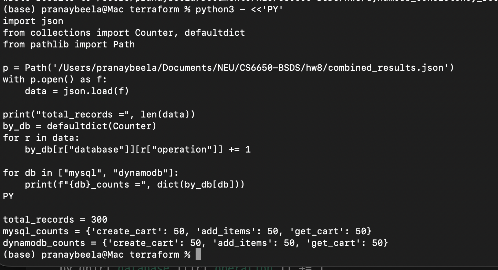
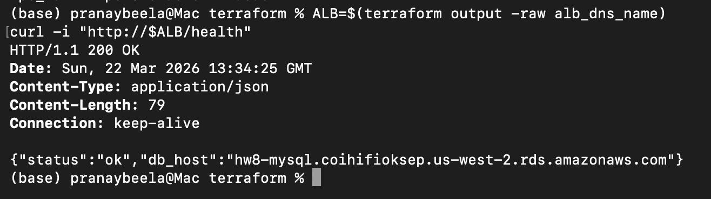
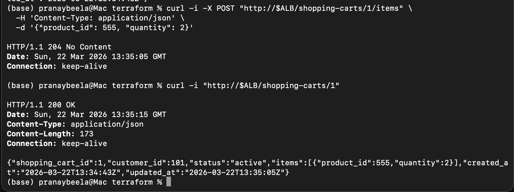
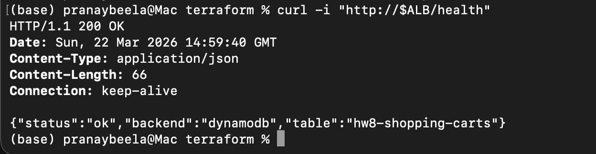
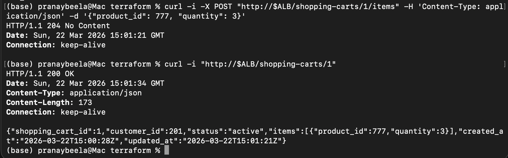
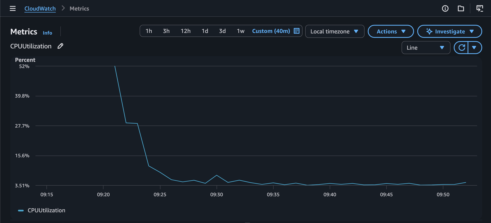
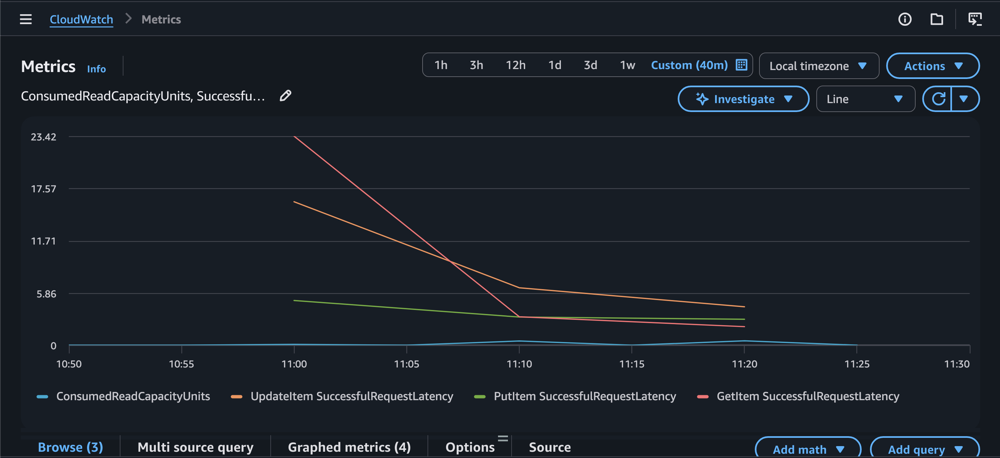

# HW8 Presentation Notes

## 1. Project Goal

This project compares **MySQL** and **DynamoDB** for the same shopping cart API.

The important part is that I kept the API the same for both backends, so the comparison is fair.

API endpoints:

- `POST /shopping-carts`
- `POST /shopping-carts/{id}/items`
- `GET /shopping-carts/{id}`
- `GET /health`

## 2. What I Built

I built the full AWS stack in Terraform:

- VPC and subnets
- ALB
- ECS Fargate service
- ECR
- RDS MySQL
- DynamoDB
- CloudWatch monitoring

Application code was written in Go, and the same service supports both backends.

## 3. Full System Architecture

The full system worked like this:

1. A client sends an HTTP request to the **Application Load Balancer**
2. The **ALB** forwards the request to the **ECS Fargate service**
3. The Go application in ECS handles the request
4. Based on configuration, the app talks to either:
   - **RDS MySQL**, or
   - **DynamoDB**
5. The response goes back through ECS and the ALB to the client
6. **CloudWatch** collects logs and monitoring metrics

### Architecture Components

- **ALB**: public entry point for the API
- **ECS Fargate**: runs the shopping cart container
- **ECR**: stores the container image
- **RDS MySQL**: relational backend used in Step I
- **DynamoDB**: NoSQL backend used in Step II
- **CloudWatch**: metrics and monitoring
- **Terraform**: provisioned the whole infrastructure

### Request Flow

For every request:

- client calls `/shopping-carts` or related endpoint
- ALB routes it to the ECS task
- ECS app chooses backend using `DB_TYPE`
- for MySQL:
  - app uses pooled SQL connections
  - reads/writes `carts` and `cart_items`
- for DynamoDB:
  - app reads/writes the `hw8-shopping-carts` table
- app sends JSON response back to the client

### Security / Networking

- ALB was internet-facing
- ECS tasks ran the API service
- RDS MySQL was placed in private subnets
- MySQL access was restricted so only ECS could connect to it
- DynamoDB did not require direct VPC database networking like RDS

## 4. Database Designs

### MySQL

I used a relational design:

- `carts`
- `cart_items`

Why this worked well:

- clean one-to-many relationship
- natural fit for shopping cart items
- safe updates with SQL constraints and transaction-style logic

Example MySQL schema:

```sql
CREATE TABLE carts (
  shopping_cart_id BIGINT AUTO_INCREMENT PRIMARY KEY,
  customer_id BIGINT NOT NULL,
  status VARCHAR(32) NOT NULL DEFAULT 'active',
  created_at TIMESTAMP NOT NULL DEFAULT CURRENT_TIMESTAMP,
  updated_at TIMESTAMP NOT NULL DEFAULT CURRENT_TIMESTAMP
);

CREATE TABLE cart_items (
  id BIGINT AUTO_INCREMENT PRIMARY KEY,
  cart_id BIGINT NOT NULL,
  product_id BIGINT NOT NULL,
  quantity INT NOT NULL,
  UNIQUE KEY uq_cart_product (cart_id, product_id),
  FOREIGN KEY (cart_id) REFERENCES carts(shopping_cart_id) ON DELETE CASCADE
);
```

### DynamoDB

I used a single-table design:

- partition key: `cart_id`
- cart items stored as an embedded list in the cart document

Why:

- the main access pattern is cart-by-ID
- no joins are needed
- good fit for key-based retrieval

Example DynamoDB item:

```json
{
  "cart_id": "42",
  "customer_id": 1001,
  "status": "active",
  "items": [
    { "product_id": 2001, "quantity": 2 },
    { "product_id": 2002, "quantity": 1 }
  ],
  "created_at": "2026-03-22T15:00:28Z",
  "updated_at": "2026-03-22T15:01:21Z"
}
```

## 5. Key Implementation Difference

This is the most important technical difference:

- **MySQL** updates cart items as relational rows
- **DynamoDB** reads the full cart, modifies it in memory, then writes it back

That mattered later in consistency testing.

## 6. Performance Test Setup

I ran the exact same workload on both databases:

- 50 create cart operations
- 50 add item operations
- 50 get cart operations
- total: **150 operations per database**

Merged results were saved in `combined_results.json`.

## 7. Main Results

### Overall Comparison

| Metric | MySQL | DynamoDB | Winner |
|--------|-------|----------|--------|
| Avg Response Time | 221.40 ms | 232.32 ms | MySQL |
| P50 | 210.58 ms | 213.93 ms | MySQL |
| P95 | 302.78 ms | 310.23 ms | MySQL |
| P99 | 320.72 ms | 358.47 ms | MySQL |
| Success Rate | 100% | 100% | Tie |

### Operation-Level Comparison

| Operation | MySQL | DynamoDB | Winner |
|-----------|-------|----------|--------|
| Create Cart | 219.93 ms | 248.65 ms | MySQL |
| Add Items | 226.18 ms | 237.08 ms | MySQL |
| Get Cart | 218.07 ms | 211.24 ms | DynamoDB |

## 8. Most Important Finding

The biggest takeaway was **not just speed**.

The biggest takeaway was **correctness under concurrent updates**.

What I saw:

- DynamoDB worked fine for simple create-and-read tests
- but rapid updates to the same cart caused **lost updates**
- MySQL handled cart updates more safely in this implementation

So even though DynamoDB is often seen as highly scalable, **MySQL was the better choice for this specific shopping cart design**.

## 9. Final Recommendation

For this assignment, I would choose **MySQL** for shopping carts because:

- it was slightly faster overall
- it had better p95 and p99 latency
- it handled concurrent cart updates more safely

When would I choose DynamoDB instead?

- if traffic is very bursty
- if scaling is the top priority
- if the app is designed carefully around key-based access and conditional writes

## 11. Screenshots

### Infrastructure / Verification


Shows that `combined_results.json` has 300 total records, with valid 50/50/50 counts for both databases.

### MySQL API Working


Shows the ALB health endpoint returning `200 OK`, meaning the ECS service and MySQL path were healthy.


Shows MySQL successfully storing and retrieving a shopping cart with item data.

### DynamoDB API Working


Shows the live service running with `backend = dynamodb`.


Shows DynamoDB successfully creating a cart, adding an item, and returning the updated cart.

### Monitoring Evidence


Shows that MySQL CPU usage stayed low during testing, so RDS was not overloaded.


Shows DynamoDB operation latency stayed stable at low millisecond levels in CloudWatch.

## 12. One-Line Conclusion

I compared MySQL and DynamoDB for the same shopping cart API, and based on my actual test results,
**MySQL was the better choice for this implementation because it had slightly better latency and
safer concurrent update behavior.**
