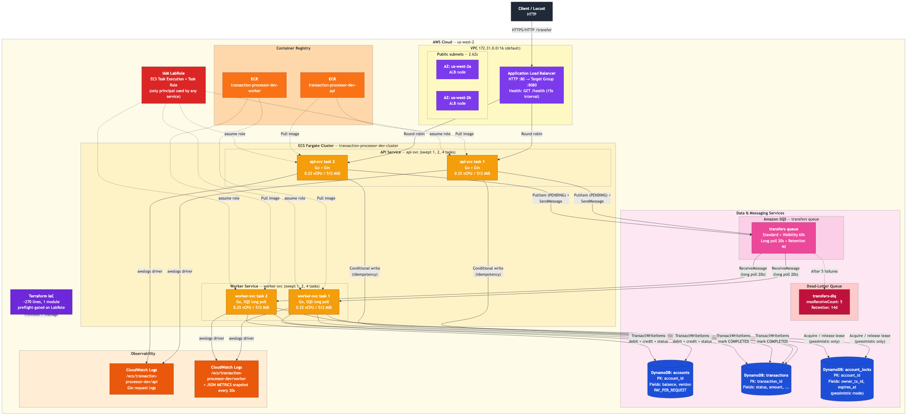

# Distributed Financial Transaction Processor

> A production-grade, cloud-native money-movement pipeline. Built on AWS as a semester-long project for **CS6650 --- Building Scalable Distributed Systems** at Northeastern University.

---

## Why we built it

Real payment systems have to handle three things at once: **high throughput**, **strong correctness** (you cannot create or lose money), and **graceful failure** (a crashed server, a duplicated message, or a network blip must never corrupt account balances). Classroom examples usually handle one of these three; real systems have to get all three right simultaneously.

The assignment gave us a chance to build such a system end-to-end --- not a toy local demo, but a real one that runs on real AWS infrastructure, survives real crashes, and is measured under real load. Over eight weeks we:

- Designed an asynchronous, horizontally-scalable architecture from first principles.
- Wrote two cooperating Go services and deployed them to AWS Fargate behind an Application Load Balancer.
- Provisioned every piece of supporting infrastructure (ECR, SQS, DynamoDB, CloudWatch) through Terraform.
- Stress-tested it with Locust from 25 to 100 concurrent users, tested crash recovery by killing live ECS tasks mid-commit, and compared two different concurrency-control strategies.
- Verified after every experiment that the total balance across all accounts stayed exactly equal to the seeded total --- no money created, no money lost.

The goal was never just "a working demo." The goal was to ship something that would make sense to anyone who has worked on real payment infrastructure.

---

## What it is

An HTTP API accepts transfer requests. Each request is recorded as `PENDING` in DynamoDB and enqueued on Amazon SQS. A separate worker fleet drains the queue, validates funds, and commits the debit, credit, and status update in a single atomic `TransactWriteItems` call against DynamoDB. Clients poll a second endpoint to learn the outcome.



Key properties we committed to up front:

- **Exactly-once financial effect** under at-least-once message delivery. Idempotency at the API, terminal-state short-circuit at the worker, and a single atomic commit per transfer.
- **Cloud-only.** Every experiment runs against real AWS services. No `docker-compose`, no local DynamoDB, no mocked endpoints in results.
- **One IAM principal.** `LabRole` is the only role wired into anything. Terraform refuses to apply under any other caller and creates zero IAM resources of its own.
- **Observable.** The worker emits atomically-incremented counters as Prometheus exposition and as periodic JSON snapshots into CloudWatch Logs, so every experiment is re-measurable after the fact.

---

## How the project progressed

We used the 8-week timeline in the project implementation plan as a living roadmap, treating each phase as a distinct commit-worthy milestone. A highly-summarized history:

### Weeks 1--2 --- foundations

The first wave of commits covered architecture finalization and the scaffolding of the two Go services. The API service got its Gin-based HTTP surface (`/health`, `POST /transfer`, `GET /transfer/:id`). The worker service got its receive-loop skeleton. The DynamoDB tables (`accounts`, `transactions`, `account_locks`) were designed in parallel, and the idempotency layer landed early so every subsequent feature could assume "a duplicate request is already safe."

By the end of week 2 the system could accept a transfer, enqueue it, process it asynchronously, and update balances. It ran nowhere but a developer laptop, but end-to-end it worked.

### Weeks 3--4 --- cloud deployment and first experiments

This is the phase where most "oh, this is actually a distributed system" problems surfaced. We:

- Wrote the Terraform stack (ECR, ECS Fargate, ALB, SQS, DynamoDB, CloudWatch, security groups).
- Built multi-stage Dockerfiles and a cross-platform image-push script (important lesson: Apple Silicon laptops build ARM64 by default, and Fargate wants `linux/amd64`).
- Wrote the Locust harness with two workload classes: a mixed `TransferUser` and a single-sender `HotAccountUser`.
- Ran the first two experiments on the deployed stack: **Experiment~1** (concurrent transfer storm against a hot account) and **Experiment~2** (worker crash recovery).

Experiment~2 was the most satisfying correctness proof in the project: we submitted a transfer with a deliberate pre-commit delay, ran `aws ecs stop-task` against the running worker, and watched ECS replace the task and SQS redeliver the message. The transfer reached `COMPLETED` and the account balances still summed exactly to the seeded total. No money lost, no money created, no duplicated transfer.

### Weeks 5--6 --- concurrency comparison and scaling

With the baseline stable, we added the second concurrency-control strategy (pessimistic locking via a short-TTL lease in a `account_locks` table) and ran the head-to-head comparison:

- **Experiment~3 --- optimistic vs. pessimistic.** Same hot-account workload, both strategies, two contention levels. The numbers showed both modes hit essentially identical throughput at the DynamoDB partition limit, but pessimistic had a tighter tail at low contention because it never retries.
- **Experiment~4 --- horizontal scaling.** Same mixed workload, sweep API and worker replicas 1:1, 2:2, 4:4 via `terraform apply -var`. Near-ideal scaling from 1 to 2 replicas (~2.9x throughput, ~13x better p95), flat from 2 to 4 because the Locust client or DynamoDB partition became the ceiling.

Both sweeps are driven by reproducible shell scripts that reseed accounts, wait for the queue to drain, snapshot counters from CloudWatch Logs, verify balances, and render charts --- no human in the loop during a run.

### Weeks 7--8 --- analysis, report, demo

The data-analysis pipeline landed: a matplotlib-based `render_charts.py` that turns each experiment's artifacts into publication-ready bar and line charts, plus a summarizer that produces markdown tables from Locust CSV exports. The final report was written in LaTeX with 20+ embedded figures drawn from both the generated charts and screenshots of the live AWS console and Locust web UI. Demo preparation was the last wave of commits.

---

## Issues we hit along the way

Nothing about deploying a real distributed system is smooth. The non-trivial problems we worked through, roughly in the order we encountered them:

1. **Apple Silicon vs. Fargate.** First ECS deployment failed with `CannotPullContainerError: image Manifest does not contain descriptor matching platform 'linux/amd64'`. Fixed by switching to `docker buildx` with explicit `--platform linux/amd64` in `scripts/push_images.sh`.

2. **No default VPC.** Terraform bombed out with `no matching EC2 VPC found` in `us-west-2`. The lab account had never had a default VPC created there. One `aws ec2 create-default-vpc --region us-west-2` unblocked everything.

3. **LabRole did not exist.** The stack assumed an AWS Academy layout. The actual university account was a Northeastern SSO account without `LabRole`. We created `LabRole` ourselves via a small idempotent bootstrap script (`scripts/bootstrap_labrole.sh`), attached the four managed policies the services needed, and confirmed it was trusted by `ecs-tasks.amazonaws.com`. The preflight check and the Terraform `check` block now both verify the role is present and ECS-assumable before any apply runs.

4. **Shell quoting on multiline JSON.** IAM trust policies pasted into `zsh` repeatedly broke brace expansion: `aws: error: the following arguments are required: --assume-role-policy-document`. We moved the trust policy to a committed file and switched every `aws iam` call to `--...-document file://`.

5. **Locust venv dependency rot.** A stale `zope.event` broke Locust import. Clean-slate venv at `/tmp/locust-venv` with `pip install locust boto3` became the canonical interpreter for both Locust and `verify_balances.py`.

6. **macOS `date` has no `%N`.** The sweep scripts originally called `date +%s%3N` to compute a millisecond timestamp for CloudWatch Logs windowing. On macOS this produces literal `...3N`, which then fails integer arithmetic. Replaced with `python3 -c 'import time; print(int(time.time()*1000))'` for cross-platform portability.

7. **Reseed racing with in-flight workers.** Between sweep iterations, rewriting the `accounts` table with plain `PutItem` collided with ongoing worker `TransactWriteItems` calls, producing `TransactionConflictException`. Fixed by adding exponential-backoff retry in `scripts/seed_accounts.go` and an explicit SQS purge plus 65-second drain before reseed.

8. **Balance verifier tripping on eventual consistency.** Early scaling runs reported transient $80--$90 discrepancies that disappeared seconds later. Two bugs, one in the script and one in the verifier: the script was running `verify_balances.py` before the queue had fully drained, and the verifier was using an eventually-consistent Scan. Fixed by waiting on `ApproximateNumberOfMessagesVisible + NotVisible == 0` (with a 15-second settle buffer) before verification, and switching the Scan to `ConsistentRead=True`.

9. **Verify failures aborting whole sweeps.** Because any single iteration's verify was mistakenly fatal, one transient mismatch would kill the rest of the sweep. Switched sweep scripts to log a warning and continue, so partial sweeps still produce usable data.

Every one of these ate at least an hour. The list is deliberately kept in the final report as well --- they are the real "distributed systems is hard" evidence.

---

## Experiment summary

| Experiment | Workload | Scale | Key result |
|---|---|---|---|
| **1. Hot-account storm** | `HotAccountUser`, 50 users, 5 min | 1 worker | 34{,}550 transfers, 0 failures, p95 530~ms, balance diff \$0.00 |
| **2. Worker crash recovery** | 1 transfer, `PRE_COMMIT_DELAY_MS=8000`, task killed mid-commit | 1 worker | Transaction reached `COMPLETED` after redelivery; balance diff \$0.00 |
| **3. Optimistic vs. pessimistic** | `HotAccountUser`, 25 and 50 users, 2 min each, both modes | 2 workers | Throughput tied (~110 req/s); pessimistic p95 lower at 25 users, both plateau at 50 users |
| **4. Horizontal scaling** | `TransferUser`, 100 users, 3 min | 1:1, 2:2, 4:4 replicas | 84.5 → 246.4 → 247.4 req/s; p95 1600 → 120 → 110 ms; 2.9x scaling 1→2, flat 2→4 |

Every experiment ended with `verify_balances.py` confirming the sum of all account balances matched the seeded $1{,}010{,}000 (101 accounts × $10{,}000), within float-rounding tolerance of $10^{-12}$.

---

## Running it yourself

The system is driven entirely through `make` targets. Every target that touches AWS is preflight-gated against `LabRole`.

```bash
# one-time setup
./scripts/bootstrap_labrole.sh                        # create LabRole if missing
cp infra/terraform.tfvars.example infra/terraform.tfvars   # fill aws_account_id
make preflight                                         # assert LabRole exists + ECS-assumable
make tf-init && make tf-apply                          # provision AWS stack
make push-images                                       # cross-build + push linux/amd64 to ECR
make tf-apply                                          # second apply so ECS picks up images
make cloud-seed                                        # seed 101 accounts
make cloud-smoke                                       # end-to-end transfer through the ALB

# experiments (all against AWS, not local)
make cloud-test-load-hot        # Experiment 1
make cloud-crash-test           # Experiment 2
make cloud-compare-locking      # Experiment 3
make scale-experiment           # Experiment 4

# analysis
make charts DIR=load-tests/experiments/<stamp>

# teardown
make tf-destroy
```

Full command reference and troubleshooting live in [`load-tests/final-report.pdf`](./load-tests/final-report.pdf).

---

## Tech stack

- **Languages:** Go 1.22 (both services and the seeder), Python 3 (Locust workloads, verification, chart generator), Bash (experiment orchestration and LabRole preflight).
- **AWS services:** Application Load Balancer, ECS on Fargate, Elastic Container Registry, Simple Queue Service (with DLQ), DynamoDB, CloudWatch Logs, IAM (read-only; we never create IAM from Terraform).
- **Infrastructure as code:** Terraform, ~270 lines, one module.
- **Load generation:** Locust in both `--headless` mode (for the CSV-producing sweeps) and web-UI mode (for live-dashboard screenshots used in the final report).

---

## Team

This was a two-person project. The work split is documented in the project implementation plan in [`project_implementation_plan.pdf`](./project_implementation_plan.pdf). At a high level:

- **Sampath Pranay Beela** --- architecture finalization, repository and service scaffolding, core transfer workflow (joint), SQS integration, containerization, cloud smoke testing (joint), load testing framework, Experiment~1, Experiments~3 and~4 (joint), data analysis and chart generation, final demo preparation (joint).
- **Rahul Chinya Jagadeesha** --- DynamoDB schema design, API-layer idempotency, local correctness verification (`verify_balances.py`), Terraform infrastructure setup, pessimistic locking implementation, Experiment~2 (worker crash recovery), final report writing.

Individual final reports detailing each author's contributions live in [`load-tests/final-report.pdf`](./load-tests/final-report.pdf).

---

## Repository layout

```
transaction-processor/
  api-svc/        # HTTP API (Gin): handlers, queue, db, models
  worker-svc/     # Async processor: processor, queue, db, metrics
  infra/          # Terraform: ECS, ALB, SQS, DynamoDB, CloudWatch
  load-tests/     # Locust workloads, verify_balances.py, final report
    experiments/  # per-run artifacts (CSVs, meta.json, metrics.json, PNGs)
    screenshots/  # AWS console and Locust web UI captures used in the report
    final-report.tex / final-report.pdf
  scripts/        # preflight, bootstrap, seed, push-images, experiment runners,
                  # crash_recovery_test.sh, compare_locking_modes.sh,
                  # scale_experiment.sh, render_charts.py, summarize_locust_results.py
  Makefile        # cloud-only targets, preflight-gated
  README.md
  project_implementation_plan.pdf
```

Every file in this tree exists because at some point during the eight weeks, a commit said "we need this, and here's why."
