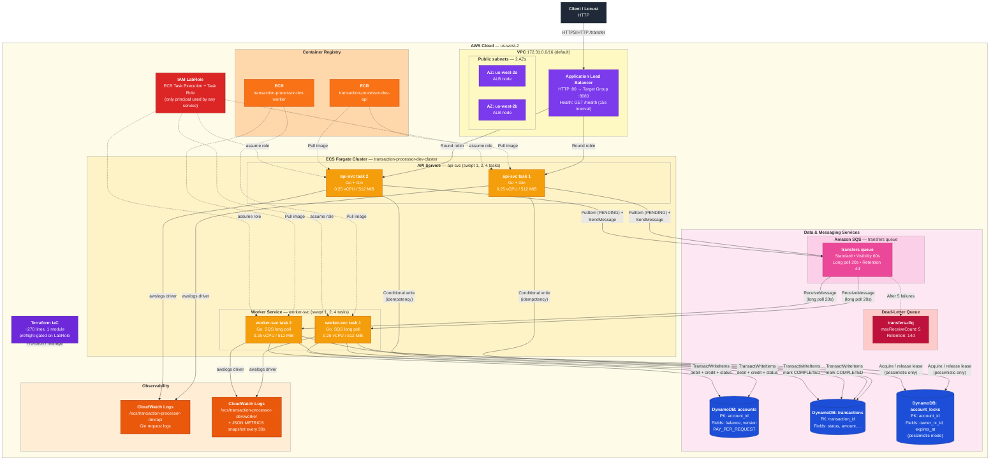

```mermaid
flowchart TD
    Client[<b>Client / Locust</b><br/>HTTP]:::client

    subgraph AWSCloud["<b>AWS Cloud</b> &mdash; us-west-2"]
        direction TB

        TF[<b>Terraform IaC</b><br/>~270 lines, 1 module<br/>preflight-gated on LabRole]:::tf

        subgraph VPC["<b>VPC</b> 172.31.0.0/16 (default)"]
            direction TB
            subgraph Subnets["<b>Public subnets</b> &mdash; 2 AZs"]
                AZA["<b>AZ: us-west-2a</b><br/>ALB node"]:::net
                AZB["<b>AZ: us-west-2b</b><br/>ALB node"]:::net
            end

            ALB["<b>Application Load Balancer</b><br/>HTTP :80 &rarr; Target Group :8080<br/>Health: GET /health (15s interval)"]:::net
        end

        subgraph Registry["<b>Container Registry</b>"]
            direction LR
            ECRApi["<b>ECR</b><br/>transaction-processor-dev-api"]:::ecr
            ECRWorker["<b>ECR</b><br/>transaction-processor-dev-worker"]:::ecr
        end

        subgraph ECSCluster["<b>ECS Fargate Cluster</b> &mdash; transaction-processor-dev-cluster"]
            direction TB
            subgraph APISvc["<b>API Service</b> &mdash; api-svc (swept 1, 2, 4 tasks)"]
                API1["<b>api-svc task 1</b><br/>Go + Gin<br/>0.25 vCPU / 512 MiB"]:::app
                API2["<b>api-svc task 2</b><br/>Go + Gin<br/>0.25 vCPU / 512 MiB"]:::app
            end
            subgraph WorkerSvc["<b>Worker Service</b> &mdash; worker-svc (swept 1, 2, 4 tasks)"]
                W1["<b>worker-svc task 1</b><br/>Go, SQS long poll<br/>0.25 vCPU / 512 MiB"]:::app
                W2["<b>worker-svc task 2</b><br/>Go, SQS long poll<br/>0.25 vCPU / 512 MiB"]:::app
            end
        end

        subgraph Data["<b>Data &amp; Messaging Services</b>"]
            direction TB
            subgraph SQSGroup["<b>Amazon SQS</b> &mdash; transfers queue"]
                SQS["<b>transfers queue</b><br/>Standard &bull; Visibility 60s<br/>Long poll 20s &bull; Retention 4d"]:::sqs
            end
            subgraph DLQGroup["<b>Dead-Letter Queue</b>"]
                DLQ["<b>transfers-dlq</b><br/>maxReceiveCount: 5<br/>Retention: 14d"]:::dlq
            end

            DDBAcc[("<b>DynamoDB: accounts</b><br/>PK: account_id<br/>Fields: balance, version<br/>PAY_PER_REQUEST")]:::ddb
            DDBTxn[("<b>DynamoDB: transactions</b><br/>PK: transaction_id<br/>Fields: status, amount, ...")]:::ddb
            DDBLock[("<b>DynamoDB: account_locks</b><br/>PK: account_id<br/>Fields: owner_tx_id, expires_at<br/>(pessimistic mode)")]:::ddb
        end

        subgraph Observe["<b>Observability</b>"]
            direction TB
            CWApi["<b>CloudWatch Logs</b><br/>/ecs/transaction-processor-dev/api<br/>Gin request logs"]:::cw
            CWWorker["<b>CloudWatch Logs</b><br/>/ecs/transaction-processor-dev/worker<br/>+ JSON METRICS snapshot every 30s"]:::cw
        end

        IAM["<b>IAM LabRole</b><br/>ECS Task Execution + Task Role<br/>(only principal used by any service)"]:::iam
    end

    Client -- "HTTPS/HTTP /transfer" --> ALB
    ALB -- "Round robin" --> API1
    ALB -- "Round robin" --> API2
    ECRApi -. "Pull image" .-> API1
    ECRApi -. "Pull image" .-> API2
    ECRWorker -. "Pull image" .-> W1
    ECRWorker -. "Pull image" .-> W2

    API1 -- "PutItem (PENDING) +<br/>SendMessage" --> SQS
    API2 -- "PutItem (PENDING) +<br/>SendMessage" --> SQS
    API1 -- "Conditional write<br/>(idempotency)" --> DDBTxn
    API2 -- "Conditional write<br/>(idempotency)" --> DDBTxn

    SQS -- "ReceiveMessage<br/>(long poll 20s)" --> W1
    SQS -- "ReceiveMessage<br/>(long poll 20s)" --> W2
    SQS -. "After 5 failures" .-> DLQ

    W1 -- "TransactWriteItems<br/>debit + credit + status" --> DDBAcc
    W2 -- "TransactWriteItems<br/>debit + credit + status" --> DDBAcc
    W1 -- "TransactWriteItems<br/>mark COMPLETED" --> DDBTxn
    W2 -- "TransactWriteItems<br/>mark COMPLETED" --> DDBTxn
    W1 -- "Acquire / release lease<br/>(pessimistic only)" --> DDBLock
    W2 -- "Acquire / release lease<br/>(pessimistic only)" --> DDBLock

    API1 -- "awslogs driver" --> CWApi
    API2 -- "awslogs driver" --> CWApi
    W1 -- "awslogs driver" --> CWWorker
    W2 -- "awslogs driver" --> CWWorker

    TF -. "Provision / manage" .-> AWSCloud
    IAM -. "assume role" .-> API1
    IAM -. "assume role" .-> API2
    IAM -. "assume role" .-> W1
    IAM -. "assume role" .-> W2

    classDef client fill:#1f2937,stroke:#111827,color:#ffffff,stroke-width:1px
    classDef net fill:#7c3aed,stroke:#5b21b6,color:#ffffff,stroke-width:1px
    classDef ecr fill:#f97316,stroke:#c2410c,color:#ffffff,stroke-width:1px
    classDef app fill:#f59e0b,stroke:#b45309,color:#ffffff,stroke-width:1px
    classDef sqs fill:#ec4899,stroke:#9d174d,color:#ffffff,stroke-width:1px
    classDef dlq fill:#be123c,stroke:#7f1d1d,color:#ffffff,stroke-width:1px
    classDef ddb fill:#1d4ed8,stroke:#1e3a8a,color:#ffffff,stroke-width:1px
    classDef cw fill:#ea580c,stroke:#9a3412,color:#ffffff,stroke-width:1px
    classDef iam fill:#dc2626,stroke:#7f1d1d,color:#ffffff,stroke-width:1px
    classDef tf fill:#6d28d9,stroke:#4c1d95,color:#ffffff,stroke-width:1px

    style AWSCloud fill:#fefce8,stroke:#a3a3a3
    style VPC fill:#fef9c3,stroke:#a3a3a3
    style ECSCluster fill:#fef3c7,stroke:#a3a3a3
    style Data fill:#fce7f3,stroke:#a3a3a3
    style Observe fill:#ffedd5,stroke:#a3a3a3
    style Registry fill:#fed7aa,stroke:#a3a3a3
    style Subnets fill:#fef9c3,stroke:#a3a3a3
    style APISvc fill:#fef3c7,stroke:#a3a3a3
    style WorkerSvc fill:#fef3c7,stroke:#a3a3a3
    style SQSGroup fill:#fbcfe8,stroke:#a3a3a3
    style DLQGroup fill:#fecaca,stroke:#a3a3a3
```
