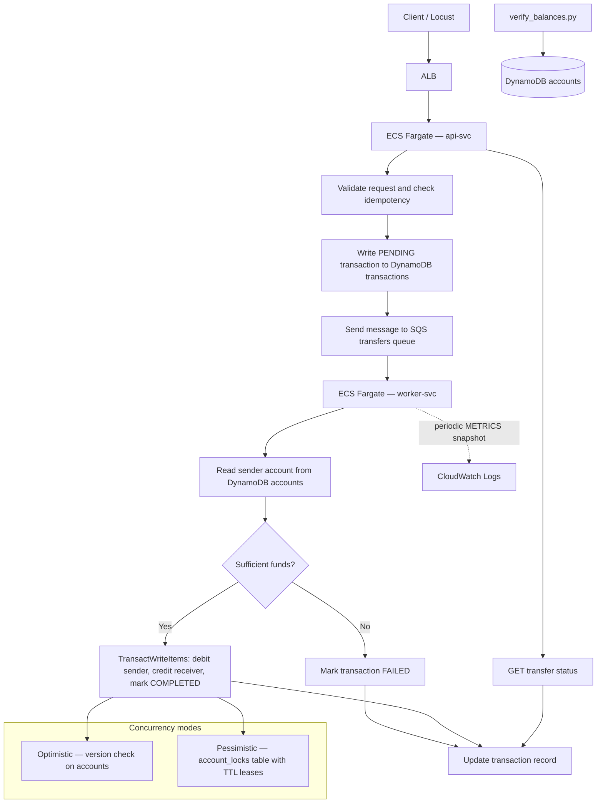

```mermaid
flowchart TD
    U[Client / Locust] --> ALB[ALB]
    ALB --> API[ECS Fargate — api-svc]
    API --> CHECK[Validate request and check idempotency]
    CHECK --> TX1[Write PENDING transaction to DynamoDB transactions]
    TX1 --> Q[Send message to SQS transfers queue]

    Q --> W[ECS Fargate — worker-svc]
    W --> ACC1[Read sender account from DynamoDB accounts]
    ACC1 --> FUNDS{Sufficient funds?}

    FUNDS -->|No| FAIL[Mark transaction FAILED]
    FUNDS -->|Yes| COMMIT[TransactWriteItems: debit sender, credit receiver, mark COMPLETED]

    FAIL --> TX2[Update transaction record]
    COMMIT --> TX2

    API --> STATUS[GET transfer status]
    STATUS --> TX2

    subgraph Concurrency modes
      OPT[Optimistic — version check on accounts]
      PESS[Pessimistic — account_locks table with TTL leases]
    end

    COMMIT --> OPT
    COMMIT --> PESS

    W -.periodic METRICS snapshot.-> CW[CloudWatch Logs]
    V[verify_balances.py] --> DB[(DynamoDB accounts)]
```
