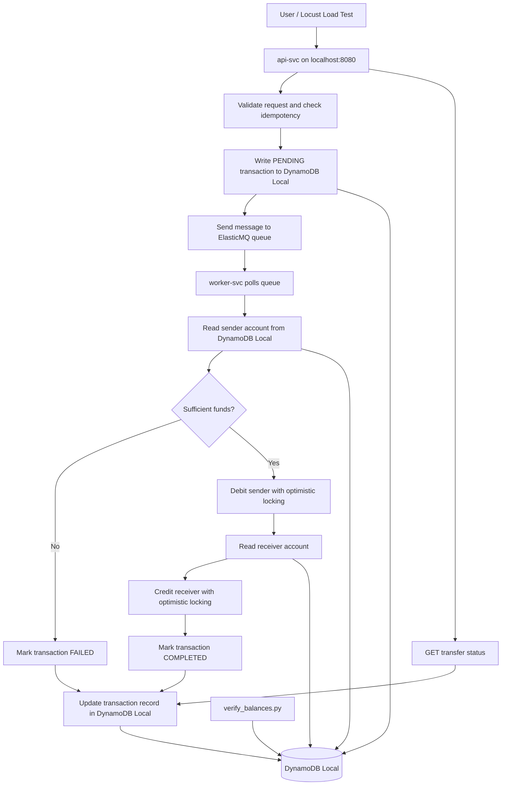

```mermaid
flowchart TD
    U[User / Locust Load Test] --> API[api-svc on localhost:8080]
    API --> CHECK[Validate request and check idempotency]
    CHECK --> TX1[Write PENDING transaction to DynamoDB Local]
    TX1 --> Q[Send message to ElasticMQ queue]

    Q --> W[worker-svc polls queue]
    W --> ACC1[Read sender account from DynamoDB Local]
    ACC1 --> FUNDS{Sufficient funds?}

    FUNDS -->|No| FAIL[Mark transaction FAILED]
    FUNDS -->|Yes| DEBIT[Debit sender with optimistic locking]
    DEBIT --> ACC2[Read receiver account]
    ACC2 --> CREDIT[Credit receiver with optimistic locking]
    CREDIT --> DONE[Mark transaction COMPLETED]

    FAIL --> TX2[Update transaction record in DynamoDB Local]
    DONE --> TX2

    API --> STATUS[GET transfer status]
    STATUS --> TX2

    V[verify_balances.py] --> DB[(DynamoDB Local)]
    TX1 --> DB
    TX2 --> DB
    ACC1 --> DB
    ACC2 --> DB

```